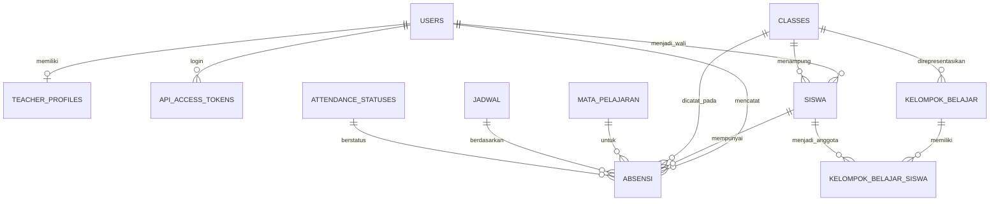

# Analisis Kesesuaian ERD Skripsi dan Implementasi

> Keputusan 7 Juli 2026: BAB 1-3 dipertahankan dan aplikasi khusus skripsi
> direkonstruksi agar mengikutinya. Kontrak lengkap ada di
> `BLUEPRINT_REKONSTRUKSI_BAB_1_3.md`.

## Sumber Audit

- Dokumen: `BAB 1 Dan 3.pdf`, bagian 3.6.1, halaman naskah 80-88.
- Backend: migration, model Eloquent, dan schema PostgreSQL `absensi_skripsi`.
- Database aktif: diperiksa secara read-only melalui Laravel `db:show` dan
  `db:table`.
- Database lokal Android: `LocalDbService` berbasis SQLite melalui `sqflite`.

## Kesimpulan

ERD pada Bab 3 belum sama dengan implementasi aplikasi. Entitas master memiliki
padanan semantik, tetapi struktur transaksi presensi, relasi guru-kelas, teknologi
penyimpanan lokal, mekanisme sinkronisasi, dan tabel notifikasi berbeda.

Bab 4 belum aman ditulis sebagai implementasi dari ERD saat ini karena akan
menjelaskan struktur yang tidak benar-benar dipakai aplikasi.

## Matriks Kesesuaian

| ERD Bab 3 | Implementasi | Status | Catatan |
|---|---|---|---|
| `USER` | `users` | Sebagian sesuai | Aplikasi memakai `name`/`email`, bukan `username`; password disimpan pada kolom `password`. |
| `GURU` | `users` + `teacher_profiles` | Sebagian sesuai | Relasi 1:1 tersedia melalui `teacher_profiles.user_id` yang unik, tetapi sebagian besar atribut guru berada di `users`. |
| `KELAS` | `classes` + `kelompok_belajar` | Sebagian sesuai | `classes` tidak memiliki `id_guru`; kelompok operasional disimpan pada `kelompok_belajar`. |
| `SANTRI` | `siswa` | Sebagian besar sesuai | `class_id` dan `nisn` bersifat nullable pada implementasi, sedangkan ERD mewajibkannya. |
| `PRESENSI` header | Tidak ada | Tidak sesuai | Implementasi tidak memiliki tabel header sesi presensi. |
| `DETAIL_PRESENSI` | `absensi` | Sebagian sesuai | `absensi` langsung menyimpan satu baris per santri, tanggal, kelas, mapel, status, dan pencatat. |
| `sync_flag` | `sync_status` pada SQLite | Konsep sesuai, struktur berbeda | Queue lokal memakai `pending`, `syncing`, `failed`, `synced`, dan `conflict`, bukan boolean. |
| Room Database | `sqflite`/SQLite | Tidak sesuai teknologi | Aplikasi Flutter memakai plugin `sqflite`, bukan Android Jetpack Room. |
| Notifikasi WhatsApp | Service dan model tersedia | Belum lengkap di DB aktif | Tabel konfigurasi/log WhatsApp belum terlihat pada database aktif yang diaudit. |

## Perbedaan Relasi

1. `USER 1:1 GURU` terwakili oleh `users` dan `teacher_profiles`.
2. `GURU 1:1 KELAS` tidak diterapkan. Guru terhubung lebih fleksibel melalui
   jadwal dan mata pelajaran.
3. `KELAS 1:N SANTRI` diterapkan melalui `siswa.class_id`.
4. `KELAS 1:N PRESENSI` diterapkan langsung melalui `absensi.class_id`, tetapi
   setiap record merupakan kehadiran satu santri, bukan header sesi.
5. `GURU 1:N PRESENSI` diterapkan melalui `absensi.actor_user_id`.
6. `PRESENSI 1:N DETAIL_PRESENSI` tidak diterapkan.
7. `SANTRI 1:N DETAIL_PRESENSI` secara praktis menjadi
   `siswa 1:N absensi`.

## Struktur Presensi Aktual

Tabel server `absensi` menyimpan:

- `id`
- `siswa_id`
- `tanggal`
- `class_id`
- `mapel_id`
- `jadwal_id`
- `attendance_status_id`
- `status`
- `keterangan`
- `actor_user_id`
- `diinput_via`
- `synced_at`
- `attendance_key`

Kombinasi identitas kehadiran dijaga oleh `attendance_key` unik. Model ini adalah
model transaksi langsung per santri, bukan model header-detail.

Database lokal menyimpan antrean pada `absensi_pending`. Data ditulis lebih dulu
ke SQLite, kemudian WorkManager dan sinkronisasi foreground mengirim satu batch
ke server. Status antrean berubah dari `pending` menjadi `synced` atau
`conflict`.

## Usulan ERD yang Sesuai Implementasi



Queue SQLite berada di perangkat dan bukan tabel PostgreSQL:

```text
absensi_pending
  id, siswa_id, tanggal, class_id, mapel_id, jadwal_id,
  status, keterangan, actor_user_id, attendance_key,
  sync_status, sync_message, retry_count, last_attempt_at, synced_at
```

## Temuan Database Aktif

- Database memiliki 66 tabel.
- Data saat audit: 17 pengguna, 3 profil guru, 60 kelas, 12 santri,
  60 kelompok belajar, dan 25 record absensi.
- Tabel `presensi` dan `detail_presensi` tidak ada.
- Sejumlah tabel di luar cakupan skripsi masih ada, termasuk tabel pembayaran,
  nilai, dan hafalan.
- Migration pembersihan lama tercatat sudah dijalankan, sehingga perubahan isi
  file migration tersebut setelah eksekusi tidak dijalankan ulang oleh Laravel.
  Pembersihan harus memakai migration baru.

## Rekomendasi

Pilihan paling aman adalah menyesuaikan Bab 3 dengan implementasi nyata, bukan
merombak aplikasi menjadi header-detail. Implementasi saat ini sudah berjalan,
memiliki kunci anti-duplikasi, mendukung batch, dan cocok dengan offline-first.

Revisi Bab 3 yang diperlukan:

1. Ganti istilah Room Database menjadi SQLite melalui plugin `sqflite`.
2. Ganti `PRESENSI` + `DETAIL_PRESENSI` menjadi satu entitas `ABSENSI`.
3. Jelaskan `attendance_key` sebagai kunci idempotensi/anti-duplikasi.
4. Ganti `sync_flag` boolean menjadi queue lokal dengan `sync_status`.
5. Ubah relasi guru-kelas dari 1:1 menjadi relasi melalui jadwal/mapel.
6. Gunakan status `Alfa` secara konsisten, bukan campuran `Alpa`.
7. Tambahkan entitas pendukung notifikasi WhatsApp jika fitur tersebut dibahas.
8. Buat migration baru untuk membersihkan tabel non-skripsi dan memastikan tabel
   WhatsApp terbentuk; jangan mengubah migration yang sudah berstatus `Ran`.

Setelah revisi tersebut diterapkan pada dokumen dan database, Bab 4 dapat ditulis
berdasarkan bukti implementasi aktual: antarmuka, SQLite queue, WorkManager,
REST API Laravel, PostgreSQL, sinkronisasi batch, penanganan konflik, dan
notifikasi WhatsApp.
